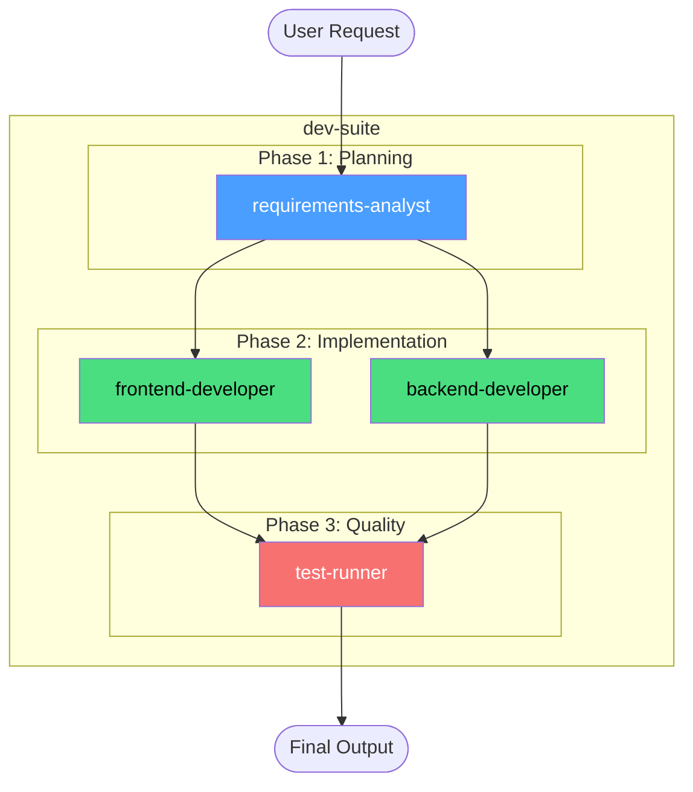
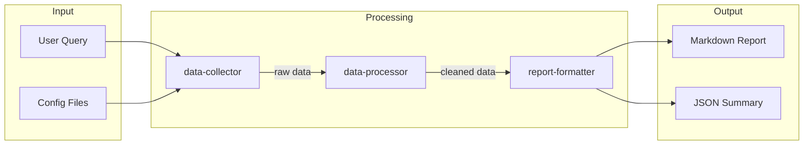
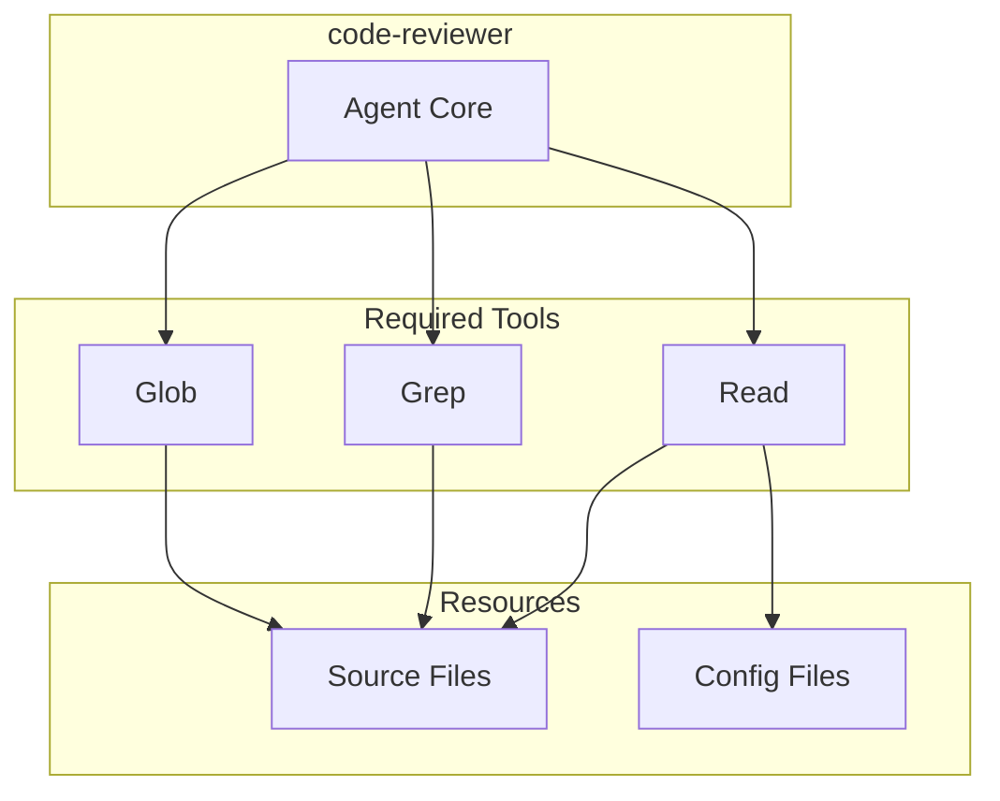
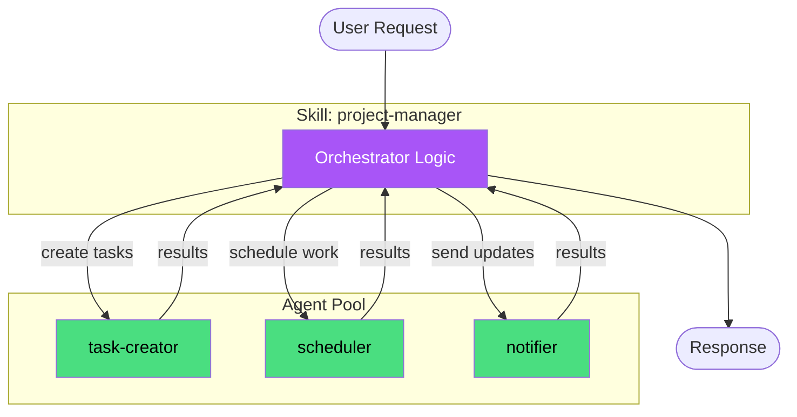
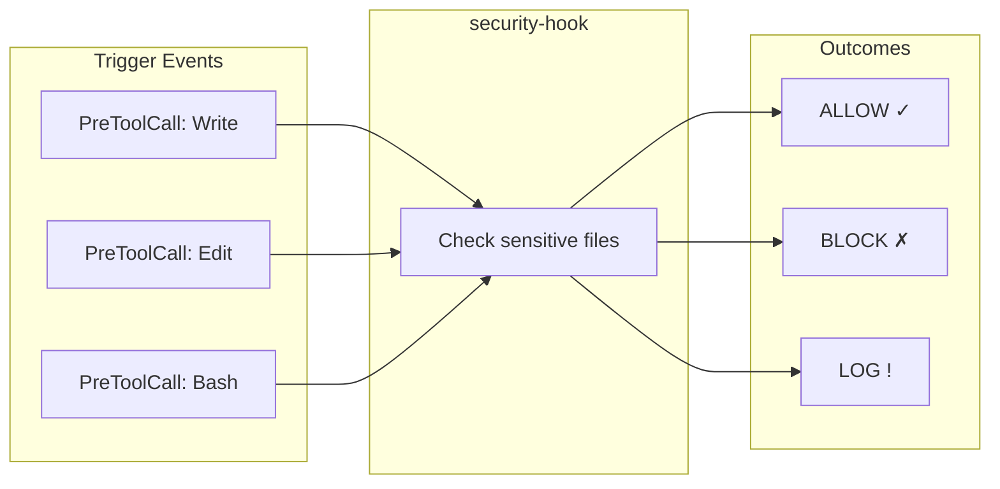
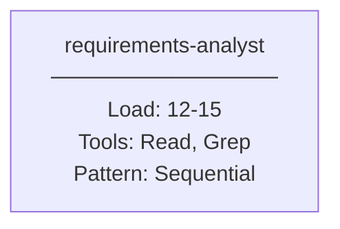

# Diagram Command

Generate visual architecture diagrams for extensions, showing agent relationships, data flow, and coordination patterns. Helps understand complex multi-agent systems before deployment.

## Usage

```
/forge:diagram [extension-path] [options]
```

## Options

| Option | Description | Default |
|--------|-------------|---------|
| `--format=<fmt>` | Output format: mermaid, ascii, markdown | `mermaid` |
| `--show=<type>` | Diagram type: architecture, dataflow, dependencies, timeline | `architecture` |
| `--output=<file>` | Save diagram to file | None (console output) |
| `--detailed` | Include tool permissions and process loads | `false` |
| `--theme=<name>` | Mermaid theme: default, dark, forest, neutral | `default` |

## Diagram Types

### 1. Architecture Diagram (`--show=architecture`)

Shows agent relationships and coordination patterns:

```
/forge:diagram ./dev-suite --show=architecture
```

Output (Mermaid):



### 2. Data Flow Diagram (`--show=dataflow`)

Shows how data flows between agents:

```
/forge:diagram ./report-generator --show=dataflow
```

Output (Mermaid):



### 3. Dependencies Diagram (`--show=dependencies`)

Shows tool and resource dependencies:

```
/forge:diagram ./code-reviewer --show=dependencies --detailed
```

Output (Mermaid):



### 4. Timeline Diagram (`--show=timeline`)

Shows execution sequence and timing:

```
/forge:diagram ./ci-pipeline --show=timeline
```

Output (Mermaid):



```mermaid
gantt
    title Suite Execution Timeline
    dateFormat X
    axisFormat %s

    section Phase 1
    requirements-analyst    :a1, 0, 3

    section Phase 2
    frontend-developer      :a2, after a1, 5
    backend-developer       :a3, after a1, 5

    section Phase 3
    test-runner            :a4, after a2 a3, 4
```

## Format Options

### Mermaid (`--format=mermaid`)

Standard Mermaid diagram syntax. Can be rendered by:
- GitHub markdown preview
- GitLab markdown preview
- Mermaid Live Editor (mermaid.live)
- Most documentation tools

### ASCII (`--format=ascii`)

Plain text box diagram for terminal display:

```
/forge:diagram ./my-suite --format=ascii
```

Output:

```
┌─────────────────────────────────────────────────────┐
│                    dev-suite                         │
├─────────────────────────────────────────────────────┤
│                                                      │
│  ┌─────────────────────┐                            │
│  │ requirements-analyst │ ← Phase 1 (Sequential)    │
│  └──────────┬──────────┘                            │
│             │                                        │
│     ┌───────┴───────┐                               │
│     ▼               ▼                               │
│  ┌─────────┐   ┌─────────┐                          │
│  │frontend │   │ backend │ ← Phase 2 (Parallel)     │
│  │developer│   │developer│                          │
│  └────┬────┘   └────┬────┘                          │
│       │             │                               │
│       └──────┬──────┘                               │
│              ▼                                      │
│  ┌─────────────────────┐                            │
│  │    test-runner      │ ← Phase 3 (Sequential)    │
│  └─────────────────────┘                            │
│                                                      │
└─────────────────────────────────────────────────────┘

Legend:
  [blue]    Strategic/Planning agents
  [green]   Implementation agents
  [red]     Quality/Validation agents
  [purple]  Coordination agents
```

### Markdown (`--format=markdown`)

Structured markdown with embedded Mermaid:

```
/forge:diagram ./my-suite --format=markdown --output=architecture.md
```

Generates a full markdown document with:
- Extension overview
- Mermaid diagram
- Agent descriptions table
- Data flow explanation
- Tool requirements matrix

## Hybrid Solution Diagrams

For hybrid solutions (skill + agents), diagrams show orchestration:

```
/forge:diagram ./project-manager --show=architecture
```

Output:



## Hook Diagrams

For hooks, shows event triggers and actions:

```
/forge:diagram ./security-hook --show=architecture
```

Output:



## Detailed View

With `--detailed`, includes additional information:

```
/forge:diagram ./dev-suite --detailed
```

Shows:
- Process load estimates per agent
- Tool permissions for each agent
- Execution patterns (parallel/sequential)
- Memory usage indicators
- Estimated execution time

Example additions to Mermaid:



## Examples

### Basic Suite Architecture

```
/forge:diagram ./my-suite
```

### Detailed Data Flow to File

```
/forge:diagram ./data-pipeline --show=dataflow --detailed --output=flow.md
```

### ASCII for Terminal

```
/forge:diagram ./quick-suite --format=ascii
```

### Dark Theme Mermaid

```
/forge:diagram ./dev-suite --theme=dark
```

### All Diagram Types

```
# Generate all views
/forge:diagram ./complex-suite --show=architecture --output=arch.md
/forge:diagram ./complex-suite --show=dataflow --output=flow.md
/forge:diagram ./complex-suite --show=dependencies --output=deps.md
/forge:diagram ./complex-suite --show=timeline --output=timeline.md
```

## Color Coding

Diagrams use consistent color coding:

| Color | Meaning | Agent Types |
|-------|---------|-------------|
| Blue (`#4a9eff`) | Strategic/Planning | Architects, analysts, planners |
| Green (`#4ade80`) | Implementation | Developers, builders, creators |
| Red (`#f87171`) | Quality/Validation | Reviewers, testers, validators |
| Purple (`#a855f7`) | Coordination | Orchestrators, managers, skills |
| Orange (`#fb923c`) | Data/Processing | Processors, transformers |
| Gray (`#9ca3af`) | Utility | Formatters, helpers |

## Integration

### With `/forge:test`

After generating a diagram, validate with testing:

```
/forge:diagram ./my-suite --show=architecture
/forge:test ./my-suite --scenario="full workflow"
```

### With `/forge:validate`

Diagrams can reveal structural issues:

```
/forge:diagram ./my-suite --show=dependencies
# Review for circular dependencies
/forge:validate ./my-suite
```

### Documentation Workflow

Generate comprehensive documentation:

```
# 1. Validate structure
/forge:validate ./my-suite

# 2. Generate diagrams
/forge:diagram ./my-suite --format=markdown --output=docs/architecture.md

# 3. Test behavior
/forge:test ./my-suite --scenario="typical usage"

# 4. Export for sharing
/forge:export ./my-suite
```

## Troubleshooting

### "Extension not found"

**Issue:** Cannot locate the extension

**Solutions:**
1. Provide full path: `/forge:diagram ./plugins/my-suite`
2. Check file exists: `ls -la ./my-suite/SKILL.md`

### "Cannot determine structure"

**Issue:** Extension type not recognized

**Solutions:**
1. Run validation first: `/forge:validate ./my-extension`
2. Check frontmatter is valid YAML

### "Diagram too complex"

**Issue:** Too many agents to render clearly

**Solutions:**
1. Use `--show=dependencies` for simpler view
2. Filter with agent name patterns (future feature)
3. Split into sub-diagrams

### "Mermaid syntax error"

**Issue:** Generated Mermaid has syntax issues

**Solutions:**
1. Check for special characters in agent names
2. Use ASCII format as fallback
3. Report issue with `/forge:feedback --issue`

## Philosophy

Visual architecture diagrams support:

1. **Understanding First:** See the big picture before diving into details
2. **Communication:** Share architecture with team members
3. **Documentation:** Auto-generate up-to-date architecture docs
4. **Validation:** Visual inspection reveals structural issues
5. **Local Only:** All rendering happens locally, no external services

## Related Commands

| Command | Purpose |
|---------|---------|
| `/forge:validate` | Validate extension structure |
| `/forge:test` | Test extension behavior |
| `/forge:diagram` | Visualize extension architecture |
| `/forge:export` | Export for cross-platform use |
