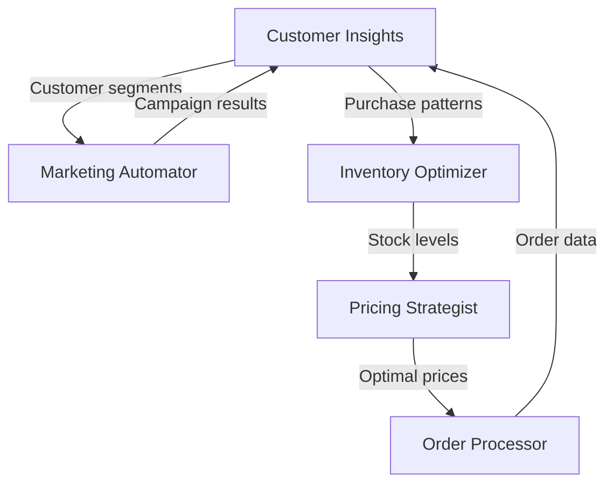

# E-Commerce Operations Suite

This is an example of a coordinated skill suite - multiple skills that work together to handle different aspects of e-commerce operations. Each skill is independent but they share data formats and can hand off to each other.

## Suite Components

### 1. inventory-optimizer
Manages inventory levels, predicts demand, and automates reordering.

### 2. order-processor
Handles order fulfillment, tracking, and customer communication.

### 3. customer-insights
Analyzes customer behavior, segments customers, and predicts churn.

### 4. pricing-strategist
Dynamic pricing optimization based on demand, competition, and inventory.

### 5. marketing-automator
Automated campaign management, email marketing, and social media posting.

## How They Work Together



## Shared Data Formats

All skills in the suite use common data structures:

```json
{
  "customer": {
    "id": "string",
    "segment": "string",
    "lifetime_value": "number",
    "churn_risk": "number"
  },
  "product": {
    "sku": "string",
    "current_stock": "number",
    "optimal_stock": "number",
    "price": "number"
  },
  "order": {
    "id": "string",
    "customer_id": "string",
    "items": [],
    "status": "string"
  }
}
```

## Suite Benefits

1. **Modular**: Use only what you need
2. **Integrated**: Skills share data seamlessly
3. **Scalable**: Add more skills as you grow
4. **Consistent**: Common patterns and interfaces
5. **Powerful**: Combined intelligence exceeds individual parts

## Example Workflow

**Morning Routine:**
1. `inventory-optimizer` checks stock levels and places orders
2. `pricing-strategist` adjusts prices based on inventory
3. `marketing-automator` sends targeted emails with new prices
4. `order-processor` handles incoming orders
5. `customer-insights` updates customer profiles

**Weekly Analysis:**
1. `customer-insights` generates segmentation report
2. `inventory-optimizer` adjusts forecasts
3. `pricing-strategist` updates pricing rules
4. `marketing-automator` plans next week's campaigns

## Suite Configuration

Central configuration shared across all skills:

```yaml
suite_config:
  business_name: "Example Store"
  industry: "fashion_retail"
  integration:
    shopify_store: "example.myshopify.com"
    email_platform: "mailchimp"
    analytics: "google_analytics"

  operating_parameters:
    reorder_lead_time_days: 14
    target_stock_days: 30
    price_update_frequency: "daily"
    customer_segment_refresh: "weekly"
```

## Installation

You can install individual skills or the complete suite:

```bash
# Individual skill
/install inventory-optimizer

# Complete suite
/install ecommerce-suite
```

## Customization

Each skill can be customized independently while maintaining compatibility:

- Adjust algorithms for your business model
- Add integrations with your tools
- Modify reporting formats
- Extend with additional features

This suite demonstrates how multiple focused skills can create a comprehensive solution while maintaining modularity and flexibility.