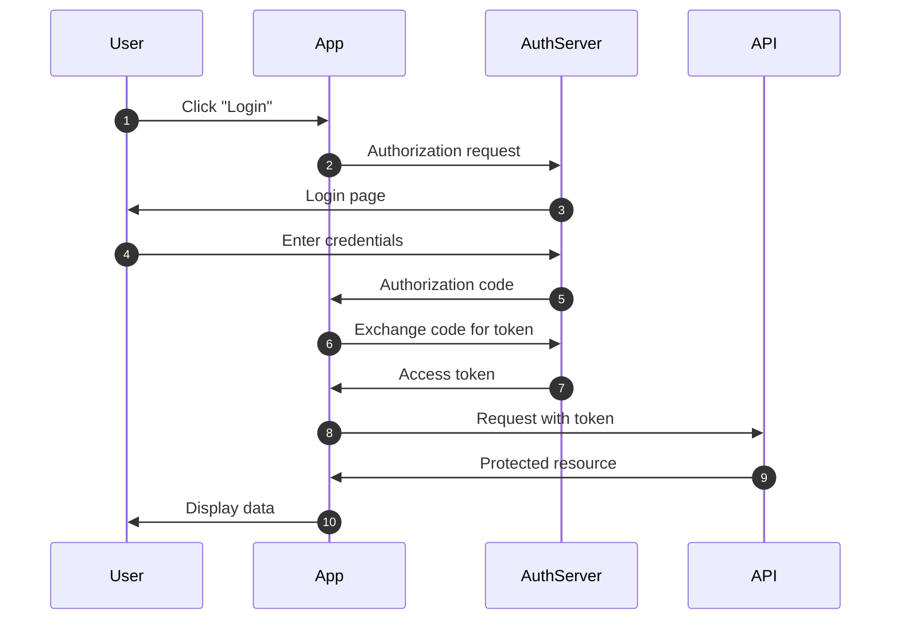
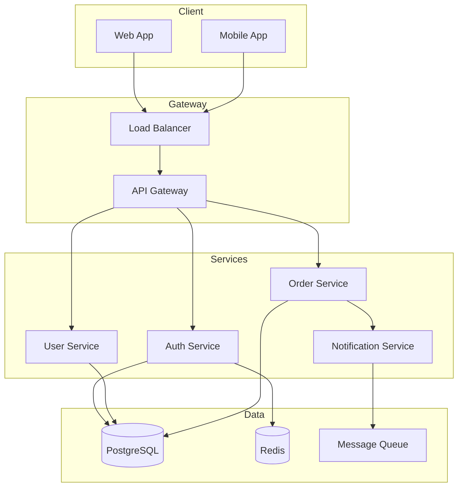

# Rune

> **Diagrams that just work.**

Rune generates beautiful, syntactically correct diagrams through intelligent format selection and validated syntax. No more broken Mermaid, no more trial-and-error.

Named after Norse magical symbols carved in stone—documentation that lasts.

---

## Quick Start

**Install:**
```bash
/plugin install rune@altakleos
```

**Use:**
Just describe what you need. Rune auto-invokes when diagrams are relevant.

```
"Show me the authentication flow"
"Create a class diagram for the User model"
"Visualize the database schema"
"Draw the system architecture in ASCII"
```

---

## What Rune Does

| Problem | Rune's Solution |
|---------|-----------------|
| Broken Mermaid syntax | Validated against Mermaid 11.x spec |
| Misaligned ASCII boxes | Character-counted alignment rules |
| Wrong diagram type | Intelligent selection based on content |
| Ugly layouts | Optimized direction, grouping, and styling |
| Confusing diagrams | Clarity-first design principles |

---

## Example Output

### Mermaid: Authentication Flow

Ask: *"Show me an OAuth2 authentication flow"*



### Mermaid: System Architecture

Ask: *"Show the microservices architecture"*



### ASCII: Architecture Diagram

Ask: *"Show the system architecture in ASCII for my terminal"*

```
┌─────────────────────────────────────────────────────────────────┐
│                         CLIENTS                                  │
│    ┌──────────────┐              ┌──────────────┐               │
│    │   Web App    │              │  Mobile App  │               │
│    └──────┬───────┘              └──────┬───────┘               │
└───────────┼──────────────────────────────┼──────────────────────┘
            │                              │
            └──────────────┬───────────────┘
                           ▼
            ┌──────────────────────────────┐
            │       Load Balancer          │
            └──────────────┬───────────────┘
                           ▼
            ┌──────────────────────────────┐
            │        API Gateway           │
            └──────────────┬───────────────┘
                           │
         ┌─────────────────┼─────────────────┐
         ▼                 ▼                 ▼
┌─────────────┐   ┌─────────────┐   ┌─────────────┐
│    Auth     │   │    User     │   │    Order    │
│   Service   │   │   Service   │   │   Service   │
└──────┬──────┘   └──────┬──────┘   └──────┬──────┘
       │                 │                 │
       └─────────────────┼─────────────────┘
                         ▼
              ┌─────────────────────┐
              │     PostgreSQL      │
              └─────────────────────┘
```

### ASCII: Directory Tree

Ask: *"Show a project directory structure"*

```
my-project/
├── src/
│   ├── components/
│   │   ├── Button.tsx
│   │   ├── Input.tsx
│   │   └── Modal.tsx
│   ├── hooks/
│   │   ├── useAuth.ts
│   │   └── useQuery.ts
│   ├── pages/
│   │   ├── Home.tsx
│   │   └── Dashboard.tsx
│   └── index.ts
├── tests/
│   └── components/
│       └── Button.test.tsx
├── package.json
└── tsconfig.json
```

---

## Supported Diagram Types

### Mermaid (20+ Types)

| Category | Diagram Types |
|----------|---------------|
| **Flow & Process** | Flowchart, Sequence, State Machine, User Journey |
| **Data & Structure** | Class Diagram, ER Diagram, Mindmap |
| **Timeline** | Gantt Chart, Timeline, Git Graph |
| **Architecture** | Architecture Diagram, C4 Model |
| **Analysis** | Pie Chart, Quadrant Chart, Sankey Diagram, XY Chart |
| **Requirements** | Requirement Diagram |

<details>
<summary><strong>Full Mermaid type reference</strong></summary>

| Type | Best For | Direction |
|------|----------|-----------|
| `flowchart` | Process flows, algorithms, decisions | LR or TB |
| `sequenceDiagram` | API calls, message passing, interactions | - |
| `classDiagram` | Code structure, inheritance, relationships | - |
| `stateDiagram-v2` | Lifecycle, modes, state transitions | - |
| `erDiagram` | Database schema and relationships | - |
| `journey` | User experience, touchpoints | - |
| `gantt` | Project timelines, scheduling | - |
| `pie` | Proportions, distributions | - |
| `gitGraph` | Git branches and commits | - |
| `mindmap` | Hierarchical concepts, brainstorming | - |
| `timeline` | Historical events, chronology | - |
| `architecture` | System components, topology | - |
| `sankey` | Resource flow, transfers | - |
| `xychart` | Data visualization, trends | - |
| `quadrantChart` | 2-axis comparison | - |
| `requirementDiagram` | Requirements traceability | - |
| `C4Context` | System context (C4 model) | - |
| `C4Container` | Container view (C4 model) | - |

</details>

### ASCII

| Diagram Type | Best For |
|--------------|----------|
| **Box Diagrams** | Component architecture, system overview |
| **Flowcharts** | Simple process flows in plain text |
| **Tree Structures** | Directory listings, hierarchies |
| **Tables** | Data grids, comparison matrices |
| **Sequence Diagrams** | Request/response flows |
| **State Machines** | State transitions |

### Coming Soon
- **PlantUML** — Complex UML, deployment diagrams, advanced styling

---

## Why Rune?

LLMs frequently generate broken diagrams. Rune prevents these errors:

### Common Mermaid Mistakes (Prevented)

| Mistake | What Happens | Rune's Prevention |
|---------|--------------|-------------------|
| Unescaped `#` or `&` | Diagram fails to render | Proper escaping rules |
| Unquoted reserved words | `end` breaks the parser | Reserved word detection |
| Inconsistent arrows | `-->` mixed with `->` | Style consistency checks |
| Missing `graph` keyword | Flowchart doesn't render | Type declaration validation |
| Too many nodes inline | Cluttered, unreadable | Layout optimization |

### Common ASCII Mistakes (Prevented)

| Mistake | What Happens | Rune's Prevention |
|---------|--------------|-------------------|
| Off-by-one box widths | Misaligned borders | Character-counted widths |
| Wrong junction characters | `├` where `┼` needed | Junction matching rules |
| Broken corners | `─` not meeting `│` | Corner validation |
| Inconsistent spacing | Jagged alignment | Padding consistency |
| Mixed box styles | Light `─` with heavy `━` | Style uniformity checks |

---

## How Rune Thinks

Rune intelligently selects the right format and diagram type:

| You Ask For | Rune Chooses |
|-------------|--------------|
| "authentication flow" | `sequenceDiagram` |
| "class structure" | `classDiagram` |
| "database schema" | `erDiagram` |
| "project timeline" | `gantt` |
| "system architecture" | `flowchart` or `architecture` |
| "in ASCII" / "for terminal" | ASCII box diagram |
| "directory structure" | ASCII tree |

**Default format:** Mermaid (renders in GitHub, GitLab, VS Code, docs)

**ASCII when:** Terminal output, plain text, email, or explicitly requested

---

## Frequently Asked Questions

<details>
<summary><strong>Does Rune work automatically?</strong></summary>

Yes. Rune auto-invokes when you ask for any diagram, visualization, flowchart, or visual representation. You don't need to call it explicitly.

</details>

<details>
<summary><strong>Can I request a specific diagram type?</strong></summary>

Absolutely. Say "create a sequence diagram" or "make an ER diagram" and Rune will use exactly that type. If you don't specify, Rune intelligently selects the best fit.

</details>

<details>
<summary><strong>When should I use ASCII vs Mermaid?</strong></summary>

**Use Mermaid** (default) when your output will render in:
- GitHub/GitLab README files
- Documentation sites
- VS Code preview
- Any Markdown viewer with Mermaid support

**Use ASCII** when you need:
- Terminal output
- Plain text files
- Email-friendly diagrams
- Universal compatibility (works everywhere)

</details>

<details>
<summary><strong>What if the diagram is too complex?</strong></summary>

Rune prefers simpler diagrams that definitely render over complex ones that might fail. For very complex visualizations, Rune will suggest breaking them into multiple diagrams or using subgraphs for organization.

</details>

<details>
<summary><strong>Can I customize the styling?</strong></summary>

Yes. Request specific colors, themes, or styling and Rune will apply them. For Mermaid, this includes built-in themes (default, dark, forest, neutral) and custom styling with CSS-like syntax.

</details>

---

## Under the Hood

| Component | Purpose |
|-----------|---------|
| **Main Skill** | Format selection (Mermaid vs ASCII) and delegation |
| **Mermaid Expert** | 20+ diagram types, Mermaid 11.x validation, styling |
| **ASCII Expert** | Box drawing, character alignment, junction rules |

**Architecture:**
```
rune/
├── SKILL.md              # Main orchestrator
└── skills/
    ├── mermaid/
    │   └── SKILL.md      # Mermaid expertise (12 KB)
    └── ascii/
        └── SKILL.md      # ASCII expertise (16 KB)
```

**Validation includes:**
- Pre-generation checklist (10 items)
- Reserved word detection
- Character alignment verification
- Syntax validation against specs

---

## Part of AltaKleos

Rune is a sibling to [Eitri](../eitri/README.md)—forged by the same team:
- **Eitri** forges Claude Code extensions
- **Rune** forges diagrams and documentation

---

**Version:** 1.0.0 | **License:** MIT
